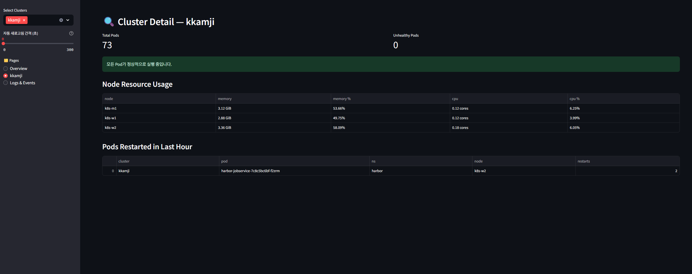

# K8s Multi-Cluster Dashboard

[](https://opensource.org/licenses/MIT)
[](https://www.python.org/downloads/)

오픈 소스 멀티 클러스터 Kubernetes 대시보드로, Streamlit을 사용하여 여러 Kubernetes 클러스터의 실시간 모니터링 및 관리 기능을 제공합니다.




## 주요 기능

- 여러 Kubernetes 클러스터 동시 모니터링
- 노드 및 Pod 간 리소스 사용량 확인
- Pod 재시작 및 비정상 Pod 추적
- 실시간 메트릭 시각화
- 간단하고 직관적인 인터페이스
- Pod 로그 및 클러스터 이벤트 조회
- 자동 새로고침 기능
- Kubernetes secrets를 통한 kubeconfig 관리

## 설치 방법

### 필수 요구사항

- Python 3.13 이상
- Poetry 패키지 관리자
- 하나 이상의 Kubernetes 클러스터 접근 권한
- kubectl이 클러스터 컨텍스트로 구성되어 있어야 함
- **metrics-server** (노드 및 Pod 리소스 사용량 확인에 필요)

### 설정

1. 저장소 복제:
   ```bash
   git clone https://github.com/yourusername/kubernetes-dashboard.git
   cd kubernetes-dashboard
   ```

2. 의존성 설치:
   ```bash
   poetry install
   ```

3. 클러스터에 metrics-server 설치:
   ```bash
   # Kubernetes 클러스터에 metrics-server 설치
   kubectl apply -f https://github.com/kubernetes-sigs/metrics-server/releases/latest/download/components.yaml

   # 설치 확인
   kubectl get deployment metrics-server -n kube-system
   ```

   > **참고**: metrics-server가 설치되지 않은 경우에도 대시보드는 작동하지만, 노드 및 Pod의 CPU/메모리 사용량 정보는 표시되지 않습니다.

   > **Minikube 사용자**: `minikube addons enable metrics-server` 명령으로 metrics-server를 활성화할 수 있습니다.

## 사용 방법

1. 대시보드 시작:
   ```bash
   # 최상위 디렉토리에서 직접 실행
   python main.py

   # 또는 Poetry 사용
   poetry run dashboard

   # 또는 Streamlit으로 직접 실행
   poetry run streamlit run src/kubernetes_dashboard/dashboard.py
   ```

2. 브라우저를 열고 `http://localhost:8501` 접속

3. 사이드바에서 모니터링할 Kubernetes 컨텍스트 선택

4. 자동 새로고침 설정 (필요한 경우)
   - 사이드바에서 새로고침 간격을 0~300초 사이로 설정
   - 0초로 설정 시 자동 새로고침 비활성화
   - 수동 새로고침 버튼 사용 가능

5. 로그 및 이벤트 페이지에서 Pod 로그와 클러스터 이벤트 확인
   - 클러스터, 네임스페이스, Pod, 컨테이너 선택 가능
   - 로그 라인 수 조정 가능
   - 이벤트 필터링 및 정렬 기능

## 개발 환경 설정

### 개발 환경 구성

```bash
# 저장소 복제
git clone https://github.com/yourusername/kubernetes-dashboard.git
cd kubernetes-dashboard

# 개발 도구를 포함한 의존성 설치
poetry install

# 가상 환경 활성화
poetry shell
```

### 테스트 실행

```bash
# 모든 테스트 실행
pytest

# 또는 자동화된 테스트 스크립트 사용
./run_and_test.sh
```

### 코드 포맷팅

```bash
# 코드 포맷팅 적용
black .
isort .

# 코드 포맷팅 검사만 수행
black --check .
isort --check .
```

## Docker 배포

```bash
# Docker 이미지 빌드
docker build -t kubernetes-dashboard .

# 컨테이너 실행 (로컬 kubeconfig 사용)
docker run -p 8501:8501 -v ~/.kube:/root/.kube kubernetes-dashboard
```

## Kubernetes 배포

1. kubeconfig 파일을 Secret으로 생성:
   ```bash
   kubectl create namespace k8s-dashboard
   kubectl create secret generic dashboard-kubeconfig -n k8s-dashboard --from-file=kubeconfig=$HOME/.kube/config
   ```

2. 대시보드 배포:
   ```bash
   kubectl apply -f kubernetes/dashboard-deployment.yaml
   ```

3. Ingress 설정 수정 (필요한 경우):
   ```yaml
   # kubernetes/dashboard-deployment.yaml 파일에서 host 값을 실제 도메인으로 변경
   - host: dashboard.example.com  # 실제 도메인으로 변경
   ```

4. 서비스 접근:
   ```bash
   # 포트 포워딩을 통한 접근
   kubectl port-forward -n k8s-dashboard svc/k8s-dashboard 8501:8501
   ```

## 테스트 환경

`kubernetes/test/` 디렉토리에는 대시보드 기능을 테스트하기 위한 매니페스트 파일이 포함되어 있습니다:

```bash
# Pending 상태 Pod 생성
kubectl apply -f kubernetes/test/pending-pod.yaml

# 재시작되는 Pod 생성
kubectl apply -f kubernetes/test/restarting-pod.yaml
```

## 기여하기

기여는 언제나 환영합니다! 자세한 내용은 [CONTRIBUTING.md](CONTRIBUTING.md)를 참조하세요.

1. 이슈 생성 또는 기존 이슈 선택
2. 포크 및 브랜치 생성
3. 코드 작성 및 테스트
4. 풀 리퀘스트 제출

## 라이센스

이 프로젝트는 MIT 라이센스를 따릅니다 - 자세한 내용은 [LICENSE](LICENSE) 파일을 참조하세요.
